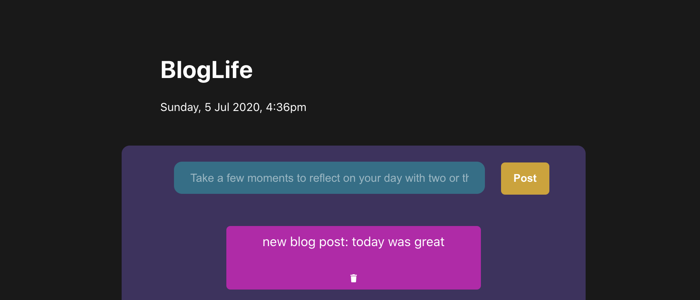

# BlogLife App

### App Overview
Have you ever found yourself wondering- "what did I even do yesterday?" I definitely have. I wanted to build this application so that people can take a pause in their daily life every evening, and reflect on their day. What did you get done? What did you want to get done, but couldn't get around to? What did you eat? Did you get the workout you wanted to in? Answering these types of questions every evening helps you hold yourself accountable to the tasks you wish to accomplish daily. Try it!

3 main benefits you achieve with this app: 
* Mindfulness: We live in a very fast-paced world, and mindfulness has never been more important in ensuring the best mental space.
* Productivity: By exercising your mind in tracing most of your daily activities, your memory and focus in the present moment sharpens.
* Reflection: Having your past entries available to you allows you to reflect and note progress, or note where you would like to make changes in your life.

### Live App
http://bloglife-dep.herokuapp.com/

### Screenshots of App

### Technologies Used
HTML, CSS, React, Express, Node, PostgreSQL
